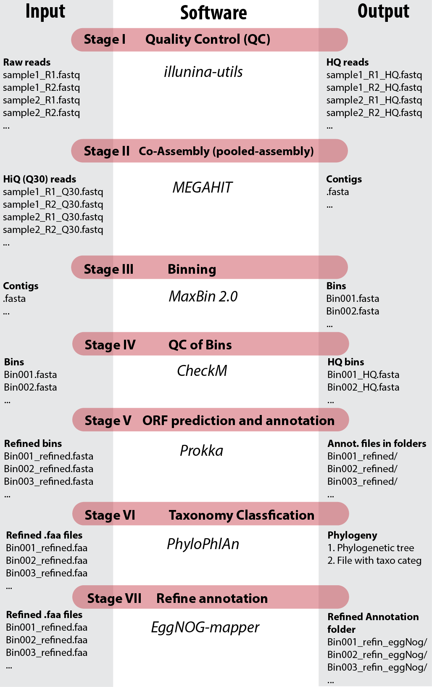

# Metagenomic assembled genomes from samples of methanotrophic microbial communities

Protocols:

1. [Lake Washington, USA](1_lake_WA/)
2. [Serpentinite Springs of the Voltri Massif, Italy](2_serpentinite_springs/)
3. [Movile Cave in Mangalia, Romania](3_movile_cave/)
4. [Santa Elena Ophiolite alkaline spring, Costa Rica](4_ophiolite)
5. [Coastal basin of Golfo Dulce, Costa Rica](5_coastal_basin)

## Pipeline
